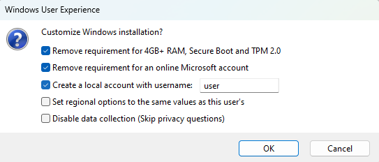

## Create USB Drive

[TPM](https://support.microsoft.com/en-us/topic/what-is-tpm-705f241d-025d-4470-80c5-4feeb24fa1ee) with [UEFI secure boot](https://wiki.debian.org/SecureBoot#:~:text=for%20more%20details.-,What%20is%20UEFI%20Secure%20Boot%3F,operating%20system%20has%20been%20loaded.), UEFI firmware itself and the [account.microsoft.com](https://account.microsoft.com) sign-in, **are not required** with this modified Windows 11 installer USB Drive. This configuration of the Windows NT kernelspace - "Windows Registry", is done by a Desktop program named "Rufus". You need:

1. A working Windows PC with internet to run the `rufus.exe`
2. A USB Drive with at least 8 GB of storage

### How it works

We use Rufus to "flash" (format and copy) a _Windows 11 `.iso`_ to an USB Drive, and configure the copy to be without the MSFT Account/SSO requirement. Doing so wipes the USB Drive entirely, **all data will be lost**. A Windows Product License Key is also not required with such an installation. Rufus will configure the system to be already "digitaly activated".

### [Download Rufus](https://github.com/pbatard/rufus/releases)

I got `rufus-3.21p.exe` (portable, 64-Bit PC). Rufus is a really good project.

- A FOSS (Free and Open Source) project, that carries a copyleft license
- Was first released in 2018-10-19
- Has thousands of users, and hundreds of contributors

### [Download a Windows `.iso`](https://www.microsoft.com/en-us/software-download)

Pick which language you want the Windows 11 system to be in.

I got `Win11_22H2_English_x64v1.iso` (2022 Second half of year, English US, 64-Bit PC, version 1). The `.iso` file is a filesystem, in which the distribution `sources\install.wim`, the _Windows Setup_/_Windows preinstallation Environment_ and a bootloader sit in.

### Step by step

1. run `rufus-VERSIONp.exe`
2. "SELECT" the `Win11_VERSION_LANGUAGE_x64_RELEASE.iso` file.
3. Enter a "Volume label" (name), for example `win-11`.
4. If you have an older PC with BIOS firmware _instead of UEFI_, change "Partition scheme" (partition table) from GPT to MBR because BIOS can't read GPT disks
5. Leave the rest on defaults and "START"
6. If everything is good, continue "OK", "OK"

Check the [Rufus wiki](https://github.com/pbatard/rufus/wiki/FAQ) if you have any problems or questions.
