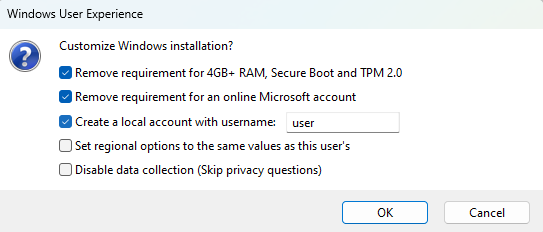

# Create bootable USB Drive

We use [Rufus](https://github.com/pbatard/rufus#readme), a desktop app, to create a "Windows 11 Setup" bootable USB Drive and configure the Windows NT kernelspace - the Windows Registry, of the system to be installed, to bypass the default restrictions. The Rufus configuration removes these requirements.

- [TPM](https://support.microsoft.com/en-us/topic/what-is-tpm-705f241d-025d-4470-80c5-4feeb24fa1ee) with [UEFI secure boot](https://wiki.debian.org/SecureBoot#:~:text=for%20more%20details.-,What%20is%20UEFI%20Secure%20Boot%3F,operating%20system%20has%20been%20loaded.)
- [UEFI](https://en.wikipedia.org/wiki/UEFI) firmware itself
- The [account.microsoft.com](https://account.microsoft.com) sign-in
- A Windows Product License Key. The system will already be "digitaly activated".

## How it works

You need the following

1. A working Windows PC with internet to run the `rufus.exe`
2. A USB Drive with at least 8 GB of storage

We use `rufus.exe` to format an USB Drive, copy a _Windows 11 `.iso`_ to it, and configure it to ignore the Microsoft imposed restrictions. Doing so wipes the USB Drive entirely, **all data will be lost**.



## [Download Rufus](https://github.com/pbatard/rufus/releases)

I got `rufus-3.21p.exe` (portable, 64-Bit PC). Rufus is a really good project.

- A FOSS (Free and Open Source) project, that carries a copyleft license
- Was first released in 2018-10-19
- Has thousands of users, and hundreds of contributors

## [Download a Windows `.iso`](https://www.microsoft.com/en-us/software-download)

Pick which language you want the Windows 11 system to be in.

I got `Win11_22H2_English_x64v1.iso` (2022 Second half of year, English US, 64-Bit PC, version 1). The `.iso` file is a filesystem, in which the distribution `sources\install.wim`, the _Windows Setup_/_Windows preinstallation Environment_ and a bootloader sit in.

## Step by step

1. run `rufus-VERSIONp.exe`
2. "SELECT" the `Win11_VERSION_LANGUAGE_x64_RELEASE.iso` file.
3. Enter a "Volume label" (name), for example `win-11`.
4. If you have an older PC with BIOS firmware _instead of UEFI_, change "Partition scheme" (partition table) from GPT to MBR because BIOS can't read GPT disks
5. Leave the rest on defaults and "START"
6. If everything is good, continue "OK", "OK"

Check the [Rufus wiki](https://github.com/pbatard/rufus/wiki/FAQ) if you have any problems or questions.

## Logs

[full log of my run](./my-run.log)

The USB Drive chosen and `.iso` to copy

```log
Found USB 2.0 device 'SanDisk Ultra USB 3.0 USB Device' (0781:5591)
Disk type: Removable, Disk size: 16 GB, Sector size: 512 bytes
```

```log
Using image: Win11_22H2_English_x64v1.iso (5.2 GB)
```

Format the USB Drive to: MBR: NTFS

There is a hack with a second partition named `UEFI:NTFS` which enables booting the NT filesystem, from UEFI firmware, because UEFI _by the spec_ is restricted to only boot bootloader binaries contained in FAT32 filesystems.

```log
Format operation started
Erasing 128 sectors
Partitioning (MBR)...
● Creating Main Data Partition (offset: 1048576, size: 14.3 GB)
Formatting to NTFS (using IFS)
Format completed.
```

Mount the new NTFS and `.iso` filesystems, and copy all files.

```log
Successfully remounted \\?\Volume{943fbff4-911f-11ed-b926-00155d9014e7}\ as E:
Extracting files...
```

Overwrite `sources\` with custom configs.

```log
Applying Windows customization:
Renamed 'E:\sources\appraiserres.dll' → 'E:\sources\appraiserres.bak'
Created 'E:\sources\appraiserres.dll' placeholder
Mounting 'E:\sources\boot.wim[2]'...
Mounted 'E:\sources\boot.wim [2]' on 'C:\Windows\TEMP\Ruf6E02.tmp'
Mounted offline registry hive 'C:\Windows\TEMP\Ruf6E02.tmp\Windows\System32\config\SYSTEM' to 'HKLM\RUFUS_OFFLINE_HIVE'
Created 'HKLM\SYSTEM\Setup\LabConfig\BypassTPMCheck' registry key
Created 'HKLM\SYSTEM\Setup\LabConfig\BypassSecureBootCheck' registry key
Created 'HKLM\SYSTEM\Setup\LabConfig\BypassRAMCheck' registry key
Created 'E:\sources\$OEM$\$$\Panther\unattend.xml'
Unmounted offline registry hive 'HKLM\RUFUS_OFFLINE_HIVE'
Unmounting 'E:\sources\boot.wim[2]'...
Unmounted 'C:\Windows\TEMP\Ruf6E02.tmp [2]'
```

The finished USB Drive. The first 1 MB is used for the partition table. 2048 sectors with a size of 512 bytes per sector.

`2048 * 512 / 1024 / 1024 = 1`

```log
Found USB device 'SanDisk Ultra USB 3.0 USB Device'
Disk type: Removable, Disk size: 16 GB, Sector size: 512 bytes
Partition type: MBR
Partition 1:
  Detected File System: NTFS
  Size: 14.3 GB (15374177280 bytes)
  Start Sector: 2048, Boot: Yes
Partition 2 (UEFI:NTFS):
  Detected File System: FAT12
  Size: 1 MB (1048576 bytes)
  Start Sector: 30029738, Boot: No
```
