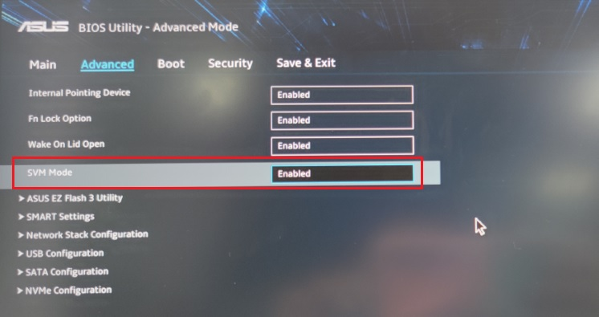
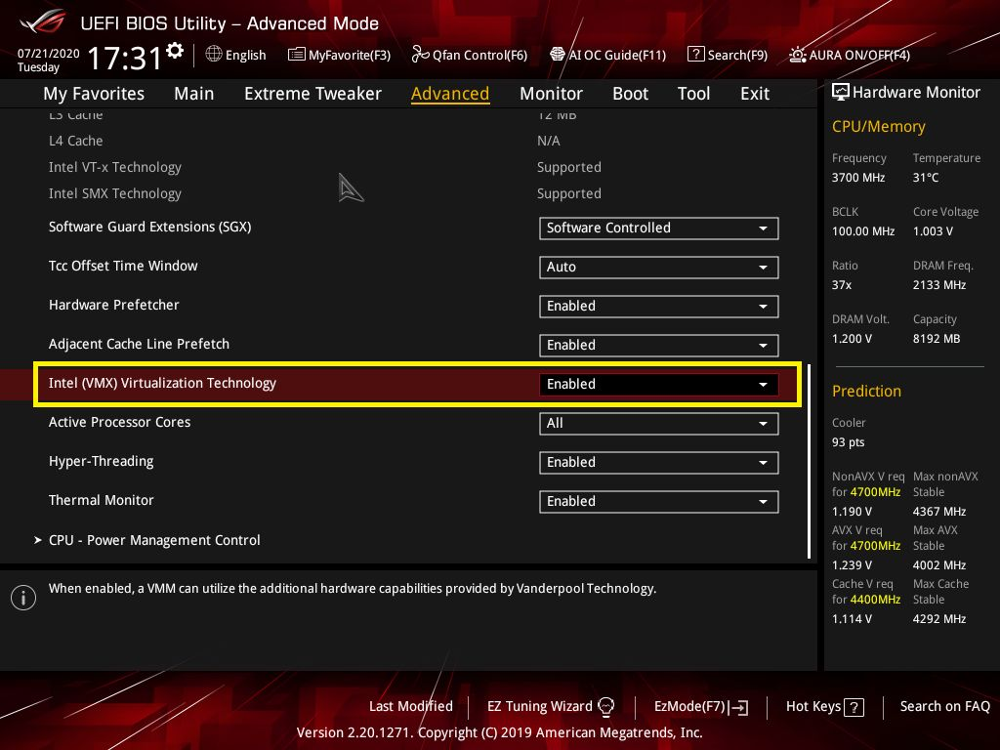
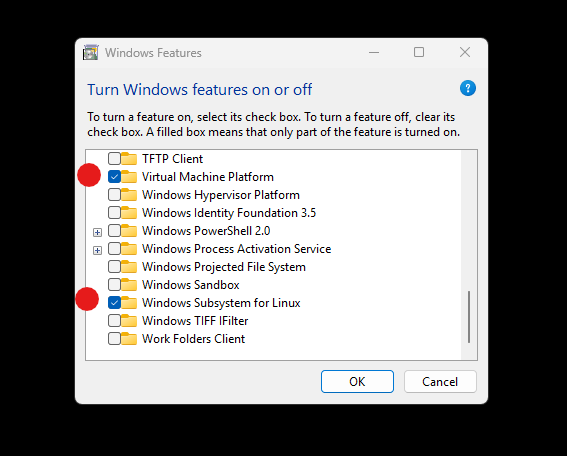

# Linux [--microsoft](https://learn.microsoft.com/windows/wsl/)

The **Windows Subsystem for Linux version 2** `wsl.exe` is a virtual machine that enables running any [Linux distribution](https://en.wikipedia.org/wiki/List_of_Linux_distributions). To install it you need:

- a modern [x86-64](https://en.wikipedia.org/wiki/X86-64) CPU, with [x86 virtualization](https://en.wikipedia.org/wiki/X86_virtualization)
- Windows 10, Windows 11, or later
- installed Windows Updates: [ms-settings:windowsupdate](ms-settings:windowsupdate)

## 1. Enable x86 virtualization

Make sure that x86 virtualization is enabled in your computer’s firmware (UEFI) settings.

_This process is different depending on CPU, motherboard, firmware. I highly recommend to do this with [ChatGPT](https://chatgpt.com/), for your unique PC build._

### AMD CPU

1. Reboot and enter UEFI
2. Open **Advanced**
3. Find the **CPU Features** or **SVM Mode** menu
4. Enable **SVM Mode**
5. Save and exit



### Intel CPU

1. Reboot and enter UEFI
2. Open **Advanced**
3. Find the **Intel Virtualization Technology** menu
4. Enable **Virtualization Technology**
5. Save and exit



```bat
REM open cmd.exe
REM check that CPU virtualzation is enabled

systeminfo.exe | find "Virtualization"
REM Virtualization-based security: Status: Running Base Virtualization Support
```

## 2. Enable WSL

1. Open Windows Settings: **System > Optional features:** [ms-settings:optionalfeatures](ms-settings:optionalfeatures)
3. Click **More Windows features**
2. Check **Virtual Machine Platform** and **Windows Subsystem for Linux**
3. Click OK and reboot



```bat
REM open cmd.exe
REM check that wsl.exe is installed

wsl.exe --version
REM WSL version: 2
```

_Very rarely it can happen that a Windows update disables some Windows features, they need to be enabled again._

## 3. Installation

Install linux and create a linux user.

Every operating system needs a user. For `username` you could use your [github.com](https://github.com) username. For `password` you could use `1`.

```bat
REM open cmd.exe

wsl.exe --install --distribution ubuntu
REM enter username
REM enter password

REM WELCOME...
# check that linux works

uname -a
# GNU/Linux
```

_The `--distribution $DISTRO` is optional and defaults to `ubuntu`._

## Done

- create, read, update and delete files in linux
- install and run any linux program
- run any server, database, container, etc
- GitOps, DevOps, SSH, etc
- **run windows programs on linux files!**

```bash
# open wsl.exe or Windows Terminal
uname -a # GNU/Linux
whomai
cd $HOME
ls /
ping 1.1.1.1

# this works!
explorer.exe .
```
