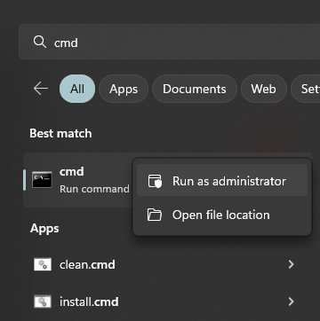
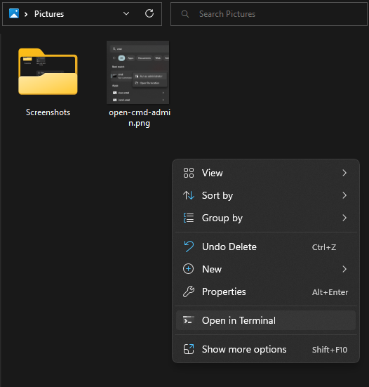

# How to download Video and Audio from the web

We do this using the Open Source program [yt-dlp](https://github.com/yt-dlp/yt-dlp). The program `yt-dlp` supports downloading from [hundreds of websites](https://github.com/yt-dlp/yt-dlp/blob/master/supportedsites.md), like `tiktok.com`, `instagram.com` and of course also `youtube.com`.

## Installation

### 1. Open a Windows Admin Shell

Open the Windows Shell (Command Prompt) `cmd.exe` as Administrator.

1. Open the Start Menu <kbd>⊞ Win</kbd>.
2. Search for `cmd`.
3. Right click and select "Open as administrator"
4. Confirm the security dialog with "yes".



### 2. Install `yt-dlp` and `vlc`

We use `yt-dlp` to download the video/audio files and `vlc` to play them.

```cmd
winget.exe install yt-dlp.yt-dlp
winget.exe install videolan.vlc
```

Now you can reopen your terminal and use `yt-dlp.exe --version`.

### 3. (Optional) Terminal on Windows 10

_This step is only required on Windows 10._

I also recommend installing the epic [new Windows Terminal](https://www.youtube.com/watch?v=8gw0rXPMMPE), Windows 11 has it installed by default.

```cmd
winget.exe install microsoft.windowsterminal
```

## Usage

```cmd
REM This is an example command
yt-dlp.exe https://www.youtube.com/watch?v=dQw4w9WgXcQ
```

Navigate to any directory in the Windows File Explorer (`explorer.exe`). For example I opened `C:\Users\junaga\Videos`. Right-click on the empty space, and select "Open in Terminal"



Once the Terminal is open, in your directory of choice, you can continue.

1. Enter `yt-dlp.exe` followed by a <kbd>Space</kbd>.
2. Paste the URL to download from, there are 3 options to do this:
    1. Press <kbd>CTRL</kbd> + <kbd>Shift</kbd> + <kbd>V</kbd> (Only works in the new Windows Terminal)
    2. Press <kbd>Shift</kbd> + <kbd>[Insert](https://en.wikipedia.org/wiki/Insert_key)</kbd> (Unix and IBM default)
    3. Right-click (Windows default)
3. Press <kbd>Enter</kbd> to run the command

`yt-dlp` downloads the video, or the playlist from the URL. If a playlist  is given, make sure the playlist link is accessible, **not private**. New YouTube playlists are private by default.

You can also use [`yt-dlp -x URL`](https://github.com/yt-dlp/yt-dlp#post-processing-options) to "extract-audio" from the video. Run `yt-dlp --help` for all options.
